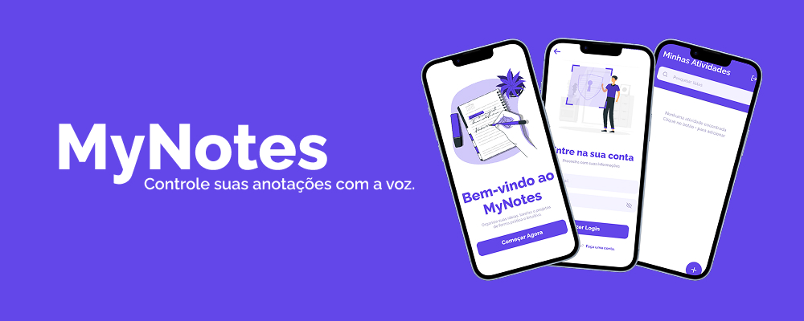

  

<h1 align="center">📝 MyNotes App</h1>

<i>Uma aplicação de anotações intuitiva, acessível e com funcionalidades inteligentes, feita com ❤️ usando React Native.</i>

---

## 📸 Preview do Projeto

   
  <small>🎞️ Visualização animada do aplicativo em funcionamento</small>

---

## 🚀 Status do Projeto

🔧 Em desenvolvimento ativo!  
Funcionalidades estão sendo adicionadas e otimizadas constantemente.

---

## ✨ Funcionalidades Principais

- 🔐 Autenticação de usuários  
- 🗒️ Criação e gerenciamento de anotações  
- 🎙️ Navegação por comando de voz  
- 🧩 Interface acessível e intuitiva  
- 🔄 Sincronização em tempo real com o banco de dados

---

## 🛠️ Tecnologias Utilizadas

- ⚛️ React Native  
- 💻 TypeScript  
- 🧪 Supabase (Backend e Autenticação)  
- 💅 Styled Components  
- 🧭 React Navigation

---

## 📱 Telas do Aplicativo

- 🔑 Login  
- 📝 Registro  
- 📋 Tela Principal (Lista de Anotações)  
- 📄 Detalhes da Anotação

---

## 🎯 Objetivos Futuros

- ✅ Implementar a navegação por voz  
- ✅ Melhorar recursos de acessibilidade  
- ✅ Adicionar novas funcionalidades de anotações  
- ✅ Otimizar a performance geral do app

---

## 🤝 Contribuição

Este é um projeto acadêmico em desenvolvimento.  
✨ Sugestões, feedbacks e colaborações são sempre bem-vindas!

---

## 📄 Licença

Este projeto está licenciado sob a licença MIT.  
Consulte o arquivo [LICENSE](./LICENSE) para mais detalhes.
